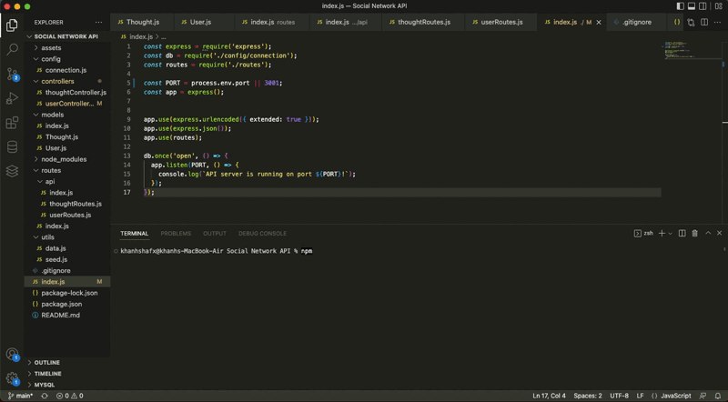

<h1 align="center">Social Network API</h1>
   
  
<p align="center">
    
    
    
    
</p>
  
<p align="center">
    
    
    
    
    
</p>
   
## Description
  
🔍 An API for a social network web application where users can share their thoughts, react to friends’ thoughts, and create a friend list.  
  
💻 Below is the gif showing the functionality of the application:
  

  
🎥 The full movie file showing functionality of the application can be found [here](./assets/Screen%20Recording%202022-10-24%20at%201.02.20%20AM.mov)  
  
## User Story
  
```
AS A social media startup
I WANT an API for my social network that uses a NoSQL database
SO THAT my website can handle large amounts of unstructured data
```
  
## Acceptance Criteria
  
``` 
GIVEN a social network API
WHEN I enter the command to invoke the application
THEN my server is started and the Mongoose models are synced to the MongoDB database
WHEN I open API GET routes in Insomnia for users and thoughts
THEN the data for each of these routes is displayed in a formatted JSON
WHEN I test API POST, PUT, and DELETE routes in Insomnia
THEN I am able to successfully create, update, and delete users and thoughts in my database
WHEN I test API POST and DELETE routes in Insomnia
THEN I am able to successfully create and delete reactions to thoughts and add and remove friends to a user’s friend list
```
  
## Table of Contents
- [Description](#description)
- [User Story](#user-story)
- [Acceptance Criteria](#acceptance-criteria)
- [Table of Contents](#table-of-contents)
- [Installation](#installation)
- [Usage](#usage)

## Installation
💾   
  
`npm init`
  
`npm i`

## Usage
💻   
  
Run the following command at th root of your project and answer the prompted questions:
  
`npm start`

`npm run dev`

`npm run seed`